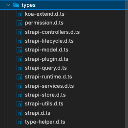
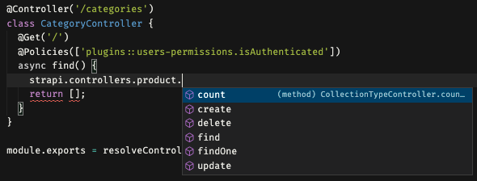
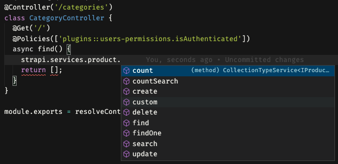

## Strapi Typescript

> template for strapi and typescript

### Strongly typed

#### Strapi types



#### types for controllers



#### types for services



## Http decorators

```typescript
@Controller('/products')
class ProductController {
  @Post('/')
  @Policies(['plugins::users-permissions.isAuthenticated'])
  async create(ctx: KoaAuthenticatedContext<ICreateProduct>) {
    await strapi
      .query('product')
      .create({ ...ctx.request.body, user: ctx.state.user.id });
    // ...
  }
}
```

The above code will auto-generate a route configuration in `routes.json`. This will override the same controller config in `routes.json`

```json
{
  "routes": [
    {
      "method": "POST",
      "path": "/products",
      "handler": "product.create",
      "config": {
        "policies": ["plugins::users-permissions.isAuthenticated"]
      }
    }
  ]
}
```

### Path alias

Only `@/` is supported. You could edit `esbuild/resolvePathAlias.ts` for other path alias

```ts
import { IProduct } from '@/typings';
import { Policies } from '@/decorators/http';
```

### Schema

- A schema defines how the data will be sent over the network which same as **DTO** in NestJS. You could use the `createSchemaPolicy` to create a policy

  ```ts
  import { createSchemaPolicy } from '@/schema';
  import { RegistrationSchema } from '@/schema/auth/Registration';

  module.exports = createSchemaPolicy(RegistrationSchema, 'body');
  ```

- If you are import `Joi` from `strapi/schema/joi`. string will automatically trimed and `presence` option is set to 'required'.

### Linter and Type check

`husky` and `lint-staged` is configured. `eslint`, `prettier` and type check will run before commit

```json
{
  "lint-staged": {
    "*.{js,ts,jsx,tsx}": [
      "eslint --rule 'no-console: [\"error\", { allow: [\"warn\", \"error\", \"debug\"] }]' --max-warnings=0",
      "bash -c \"tsc --noEmit\"",
      "prettier --ignore-path .eslintignore --write"
    ],
    "{*.json,.{babelrc,eslintrc,prettierrc}}": [
      "prettier --ignore-path .eslintignore --write"
    ],
    "*.{css,scss}": [
      "prettier --ignore-path .eslintignore --single-quote --write"
    ],
    "*.{yml,md}": [
      "prettier --ignore-path .eslintignore --single-quote --write"
    ]
  }
}
```

### unit / e2e test

See the [docs](docs/docs/test.md)
